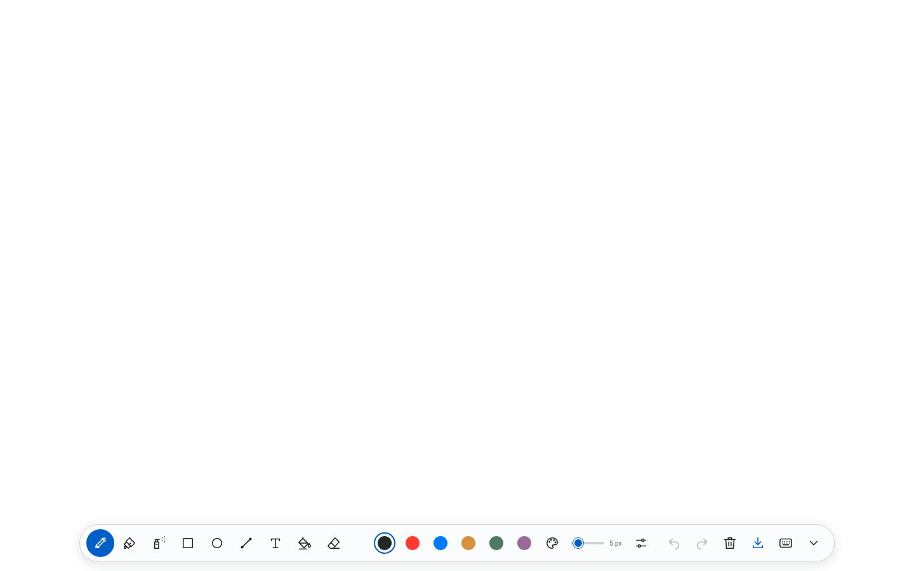

# Tuval

Tuval is a full-screen drawing canvas that works with a mouse, finger, or stylus. It keeps the original canvas's nine tools, with smooth freehand strokes, an accessible toolbar, and local autosave.

**[Open the studio →](https://tuvall.netlify.app)**



## What you can do

- Draw with a pen, translucent marker, or spray brush.
- Add rectangles, circles, straight lines, and text; fill connected areas or erase.
- Choose preset colors or use the custom HSV, HEX, and RGB picker with opacity.
- Adjust brush size from 1 to 50, enable stylus pressure, or disable finger drawing.
- Undo and redo; clear a drawing with confirmation and recover it with Undo.
- Save, undo, redo, and clear from the floating bottom toolbar. There is no header or document-name display.
- Collapse the toolbar and drag its pen button. Narrow screens have a swipeable tool row and navigation arrows.
- Save a PNG of the full drawing, even after resizing or rotating the screen.

## Run locally

Use Node.js 22.12 or newer. CI and Netlify use Node.js 24.

```sh
git clone https://github.com/Eymistaken/tuval.git
cd tuval
npm ci --ignore-scripts
npm run dev
```

Open the local URL printed by Vite. No environment variables, accounts, API keys, or backend are required.

| Command | Purpose |
| --- | --- |
| `npm run dev` | Local development with automatic reload |
| `npm run build` | Production assets in `dist/` |
| `npm run preview` | Serve the production build on port 4173 |
| `npm run lint` | JavaScript syntax and American English checks |
| `npm test` | Drawing geometry, colors, fill, input, and history tests |
| `npm run test:e2e` | Desktop, phone, and iPad Safari browser tests |
| `npm run check` | Source checks, unit tests, build, and browser tests |

Install the browsers before running browser tests:

```sh
npx playwright install --with-deps chromium webkit
npm run check
```

## Shortcuts

| Action | Shortcut |
| --- | --- |
| Pen / Marker / Spray | `P` / `M` / `A` |
| Rectangle / Circle / Line | `R` / `O` / `L` |
| Text / Fill / Eraser | `T` / `F` / `E` |
| Undo | `Ctrl+Z` |
| Redo | `Ctrl+Shift+Z` or `Ctrl+Y` |
| Save PNG | `Ctrl+S` |
| Smaller / Larger brush | `[` / `]` |

On macOS, use Command instead of Ctrl. Shortcuts pause while entering text or using a dialog. Arrow keys, Home, and End move focus through the tool row.

## Your drawing and privacy

Artwork stays in this browser's IndexedDB. Brush settings use localStorage; an unsaved drawing also gets a synchronous localStorage recovery copy when leaving or reloading the page. Tuval does not upload drawings or use analytics. The save status confirms when the current drawing has been written. Export a PNG to keep a portable copy; clearing browser data removes the local drawing. Undo history lasts for the current session and is bounded to 30 entries and 128 MiB, with fewer entries for large canvases.

The legacy `smartCanvas_img` localStorage key is read when no new drawing exists. This migration works within the same browser origin; a drawing saved by a local HTML file or another address cannot be read by the hosted site.

## Architecture

The application uses browser-native JavaScript modules, Canvas 2D, and Vite. It has no runtime package dependencies.

```text
src/
  engine/       Retained document, tools, smooth strokes, pointers, fill, history
  ui/           Toolbar, color picker, dialogs, and SVG icons
  styles/       Responsive studio design
  main.js       Application wiring and save/export coordination
  storage.js    IndexedDB drawing storage and legacy migration
public/         Static assets
legacy/         Original single-file application, retained as a reference
tests/          Unit and browser regression tests
```

The retained document canvas is independent of the displayed canvas. It grows when the viewport needs more room and never shrinks. Artwork keeps its logical size during rotation; regions outside the current viewport remain in the saved document and PNG export. Undo snapshots preserve their original coordinates after expansion. An opaque preview layer applies opacity once per stroke. Pointer capture and coalesced samples support smooth input; extra pointers are ignored and canceled strokes are discarded.

[Architecture decision](docs/decisions/001-canvas-modules.md) · [Current design](docs/superpowers/specs/2026-10-01-minimal-canvas-design.md) · [Contributing](CONTRIBUTING.md)

## Deployment

The production address is **https://tuvall.netlify.app**. Netlify uses `npm run build` and publishes `dist/`; settings and security headers are in `netlify.toml`. Do not publish the project root, which includes the legacy reference and development files. Future Git-based deployments should use the `main` branch.

## Browser support

Current Chrome, Edge, Firefox, and Safari with Canvas 2D, Pointer Events, IndexedDB, ResizeObserver, and native dialogs. Automated coverage runs Chromium on desktop and phone profiles and WebKit on an iPad profile. Real stylus hardware, palm detection, and device latency still depend on the browser and operating system. Pressure applies to the pen tool; disabling finger drawing is available when using a stylus.
